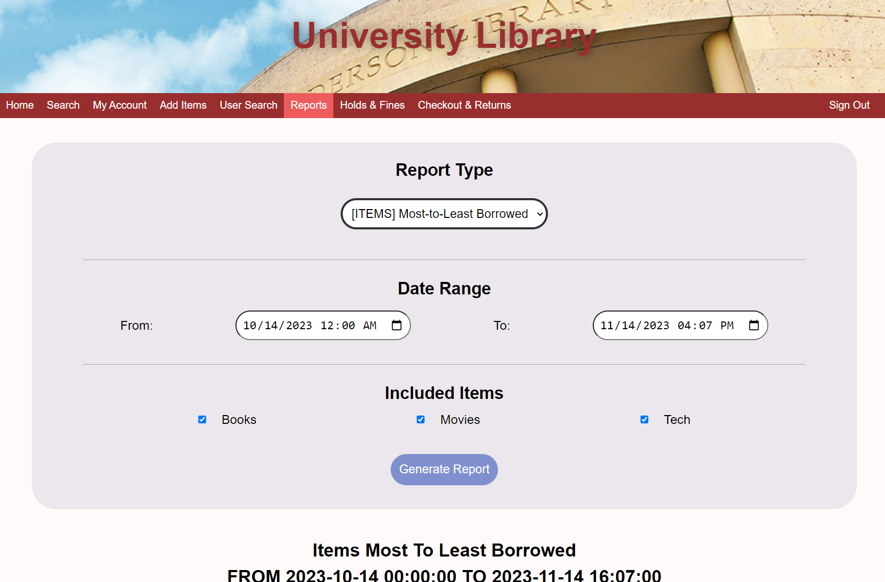

# University Library Management System

This project was collaborated with a team of four. Over 4 months, we designed and implemented a comprehensive Library Management System for a university library. The project starting with the conceptualization and sketching of the database schema to deployment and presentation.

This system facilitates borrowing various items such as books, media, and devices by students, faculty, and managers, each having distinct abilities and roles within the system.

  

### ☆ ──── Technologies ──── ☆
• HTML  
• CSS  
• Javascript  
• PHP  
• mySQL  
  

### ☆ ──── Features ──── ☆
• **Borrowing Functionality:**  
&nbsp;&nbsp;&nbsp;&nbsp;• Allows students and faculty to borrow various types of items including books, media, devices, etc.  

• **Manager Controls:**  
&nbsp;&nbsp;&nbsp;&nbsp;• **Fines Management:**  
&nbsp;&nbsp;&nbsp;&nbsp;&nbsp;&nbsp;&nbsp;&nbsp;• Enables the manager to oversee and manage fines incurred by users for late returns.  
&nbsp;&nbsp;&nbsp;&nbsp;• **Hold Requests:**  
&nbsp;&nbsp;&nbsp;&nbsp;&nbsp;&nbsp;&nbsp;&nbsp;• Provides the capability to place requests or holds on specific items.  

• **Different Borrowing Limits:**  
&nbsp;&nbsp;&nbsp;&nbsp;• **Student Limit:**  
&nbsp;&nbsp;&nbsp;&nbsp;&nbsp;&nbsp;&nbsp;&nbsp;• Implements a limit on the number of items that a student can borrow.  
&nbsp;&nbsp;&nbsp;&nbsp;• **Faculty Limit:**  
&nbsp;&nbsp;&nbsp;&nbsp;&nbsp;&nbsp;&nbsp;&nbsp;• Implements a separate limit for faculty members.  

• **Different Due Dates:**  
&nbsp;&nbsp;&nbsp;&nbsp;• **Student Due Date:**  
&nbsp;&nbsp;&nbsp;&nbsp;&nbsp;&nbsp;&nbsp;&nbsp;• Sets a different due date for items borrowed by students.  
&nbsp;&nbsp;&nbsp;&nbsp;• **Faculty Due Date:**  
&nbsp;&nbsp;&nbsp;&nbsp;&nbsp;&nbsp;&nbsp;&nbsp;• Sets a distinct due date for items borrowed by faculty.  

• **Unique Item IDs:**  
&nbsp;&nbsp;&nbsp;&nbsp;• Assigns a unique ID to each item in the library, allowing for precise tracking and management.  

• **Handling Multiple Copies:**  
&nbsp;&nbsp;&nbsp;&nbsp;• **Duplicate Items:**  
&nbsp;&nbsp;&nbsp;&nbsp;&nbsp;&nbsp;&nbsp;&nbsp;• Accounts for scenarios where the library may have multiple copies of the same item.  

• **Fines and Late Returns:**  
&nbsp;&nbsp;&nbsp;&nbsp;• **Fines Calculation:**  
&nbsp;&nbsp;&nbsp;&nbsp;&nbsp;&nbsp;&nbsp;&nbsp;• Calculates fines based on the duration of late returns.  
&nbsp;&nbsp;&nbsp;&nbsp;• **Fine Details:**  
&nbsp;&nbsp;&nbsp;&nbsp;&nbsp;&nbsp;&nbsp;&nbsp;• Includes a system for recording and displaying fine details for users.  

• **User Details:**  
&nbsp;&nbsp;&nbsp;&nbsp;• **User Profiles:**  
&nbsp;&nbsp;&nbsp;&nbsp;&nbsp;&nbsp;&nbsp;&nbsp;• Stores and manages user details, including personal information and borrowing history.  

• **Intuitive User Interface:**  
&nbsp;&nbsp;&nbsp;&nbsp;• **User-Friendly Interface:**  
&nbsp;&nbsp;&nbsp;&nbsp;&nbsp;&nbsp;&nbsp;&nbsp;• Provides an intuitive and easy-to-navigate web interface for all users.  

• **Administrative Controls:**  
&nbsp;&nbsp;&nbsp;&nbsp;• **Administrative Dashboard:**  
&nbsp;&nbsp;&nbsp;&nbsp;&nbsp;&nbsp;&nbsp;&nbsp;• Offers administrative controls for managing fines, holds, user details, and more.  

 
### ☆ ──── Screenshots ──── ☆

  

 

    
    
    
    

  
 
